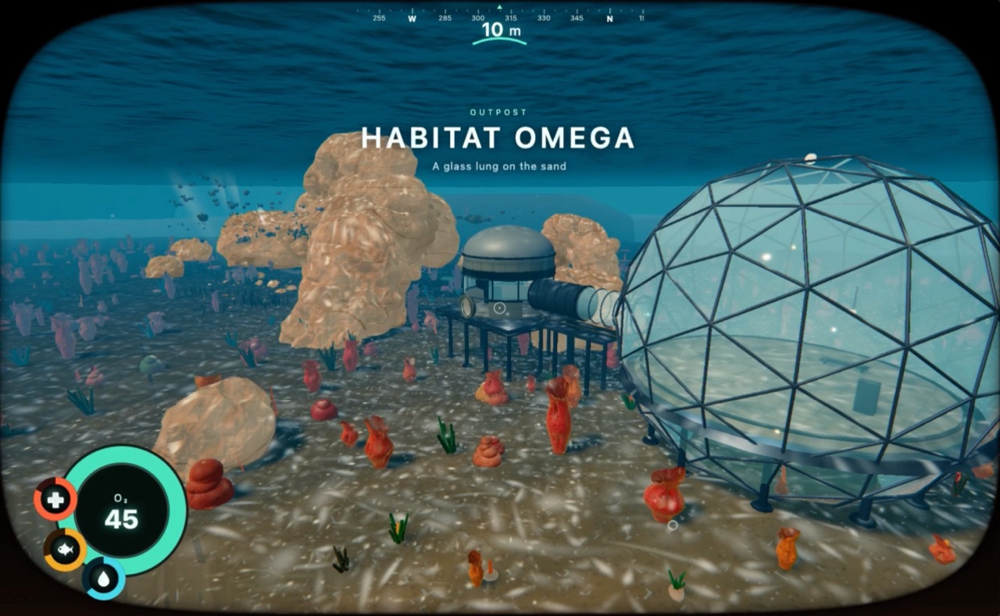
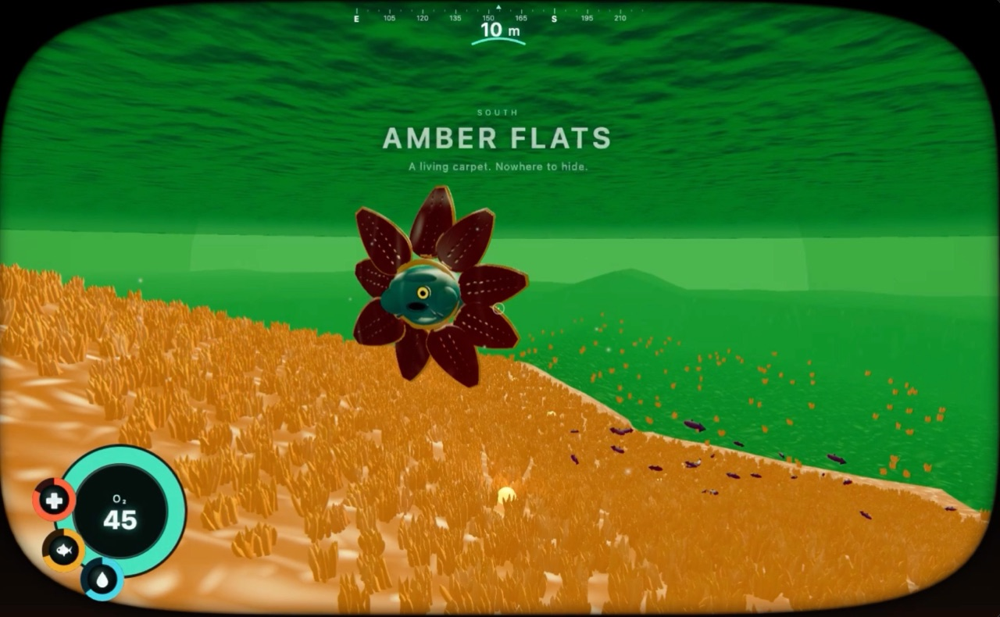
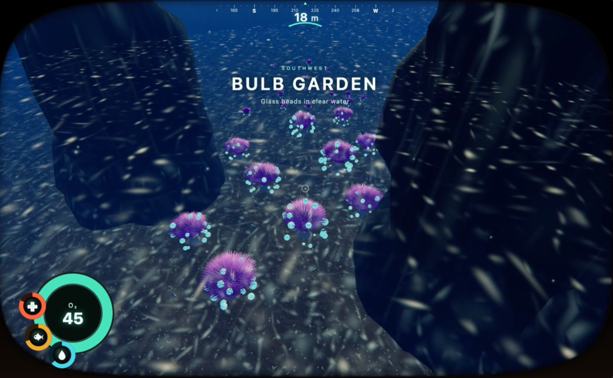
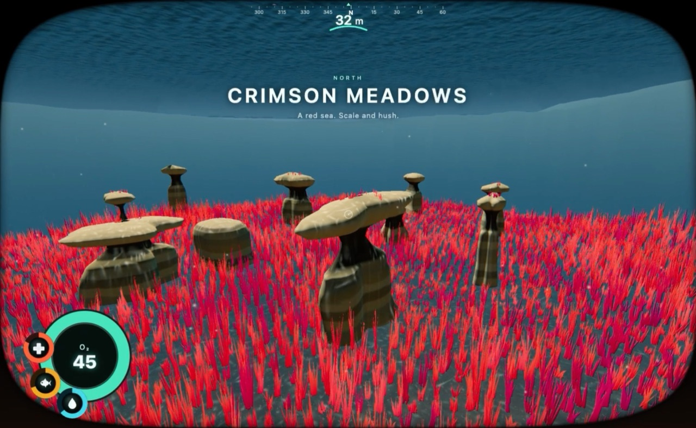

# SUBWAVE

A swimable underwater world in the browser: eight biomes, an alien sky, a volcanic island you can walk, an enterable seabase, and a cinematic walkthrough. Built with [Grok 4.6](https://x.ai) in the Grok Build CLI (including the new Workflows), Three.js (WebGL), and Vite.

<table>
  <tr>
    <td></td>
    <td></td>
  </tr>
  <tr>
    <td></td>
    <td></td>
  </tr>
</table>

## Run locally

Needs Node.js 18+ and a current Chromium-based browser (WebGL).

```bash
npm install
npm run dev
```

Then open [http://127.0.0.1:5173/](http://127.0.0.1:5173/). Click the canvas to lock the pointer and dive.

## Controls

| Input | Action |
| --- | --- |
| Click | Pointer lock |
| WASD | Swim |
| Space | Up |
| C or Ctrl | Down |
| Shift | Dash |
| `]` or `B` | Next biome |
| `[` | Previous biome |
| `1`–`8` | Jump to a biome |
| `N` | Warp to the seabase |
| `E` | Enter the seabase when prompted |
| `G` or `F9` | Start / stop the walkthrough |
| `Shift-G` | Start the walkthrough and record |
| `F8` or `P` | Screenshot |
| `Esc` | Exit the walkthrough (or pointer lock) |

MIT. See [LICENSE](LICENSE).
